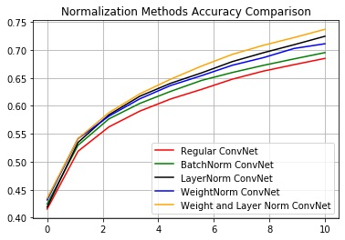
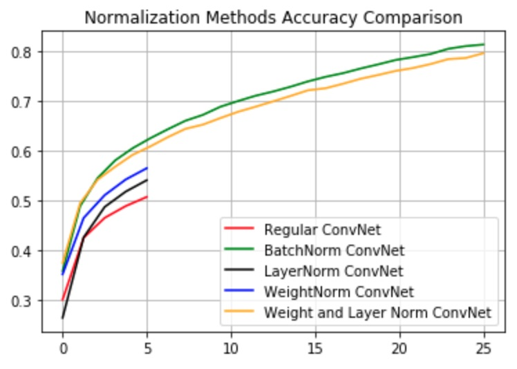
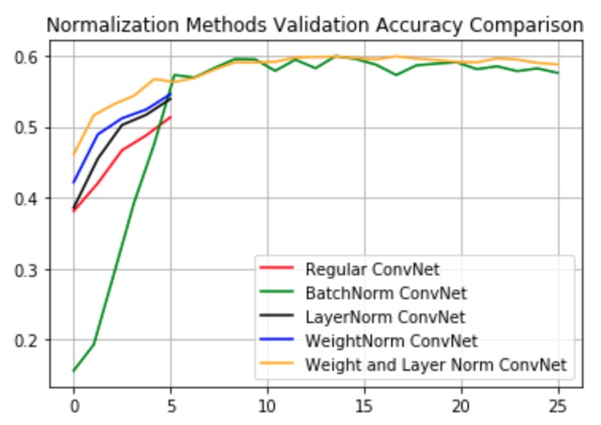

# Comparison of Normalization Techniques on Feed-FWD CNN

This miniproject provides a high level comparison of the performance of Batch Normalization, Layer Normalization and Weights Normalization layers on convolutional neural network (CNN) applied to CIFAR10 classification task. All normalization layers demostrate marked improvement as compared to the regular (non-regularized) CNN. Additionally, Layer and Weights Normalization layers outperform the Batch Normalization layer. Interestingly, the combination of Layer and Weight normalization layers seem to have additive effect producing the best performing network:

Accuracy Results for Batch Size 32 | Accuracy Results for Batch Size 512
|:---:|:---:|
|  |  |
|  |  |
